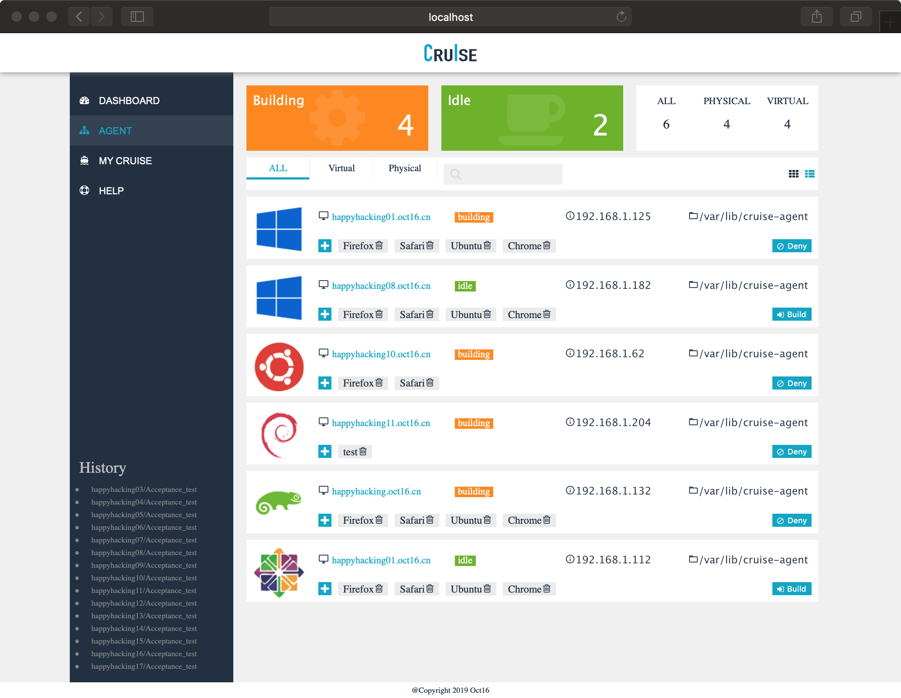

## A Mini React Demo    

#### TODO

- [x] **ENV**
- [x] **TSX**
- [x] **Diff Engine** [Reconciliation](https://reactjs.org/docs/reconciliation.html) [Article](https://github.com/hujiulong/blog/issues/4)
    - [x] **Element Diff**
    - [x] **Component Diff**
    - [ ] **Key Strategy**
- [x] **Life Cycle**
- [x] **Props**
- [x] **Demo**
- [ ] **Async Queue** [Why is setState asynchronous?](https://github.com/facebook/react/issues/11527)
- [x] **Router & Link** [Build your own React Router v4](https://tylermcginnis.com/build-your-own-react-router-v4/)
- [ ] **Redux**
- [ ] **Refs**
- [ ] **HOC**
- [ ] **...**

---
Demo: [https://oct16.github.io/mini-react/](https://oct16.github.io/mini-react/)

